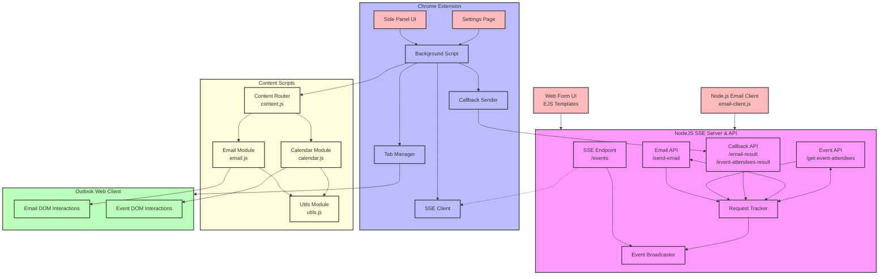

# Architecture Overview

This document outlines the architecture and data flow of the Outlook Email Assistant system, which enables sending emails and retrieving event details through Outlook Web Client via a Chrome extension that can receive instructions from external sources using Server-Sent Events (SSE) and report results back through callbacks.

## System Components

The system consists of five main components:

1. **Web Form Interface**: A user-facing web application for composing email instructions and requesting event details
2. **NodeJS SSE Server**: A server that broadcasts instructions to connected clients and receives operation results
3. **Chrome Extension**: A browser extension that receives instructions, interacts with web applications, and reports results
4. **Outlook Web Client**: The target web application where emails are composed and event details are retrieved
5. **Programmatic Email Client**: A Node.js application for sending emails programmatically

## Data Flow

```
┌─────────────────┐     HTTP POST     ┌─────────────────┐     SSE Event     ┌─────────────────┐     DOM Interaction     ┌─────────────────┐
│                 │                   │                 │                   │                 │                         │                 │
│   Web Form UI   │ ───────────────> │   NodeJS SSE    │ ───────────────> │ Chrome Extension│ ───────────────────────>│  Outlook Web    │
│                 │  (Request Data)   │     Server      │ (Instruction)     │  Background     │  (Automated UI Actions) │     Client      │
│                 │                   │                 │                   │     Script      │                         │                 │
└─────────────────┘                   └─────────────────┘                   └─────────────────┘                         └─────────────────┘
                                            ▲                                      │
                                            │                                      │
                                            │     HTTP Callback                    │
                                            └──────────────────────────────────────┘

┌─────────────────┐     HTTP POST     ┌─────────────────┐
│                 │                   │                 │
│  Node.js Email  │ ───────────────> │   NodeJS SSE    │
│     Client      │  (Email Details)  │     Server      │
│                 │                   │                 │
└─────────────────┘                   └─────────────────┘
```

## Component Diagram



### Step-by-Step Flow

#### Email Sending Flow

1. **Email Composition** (Web Form/Node.js Client → NodeJS Server)
   - User fills out email details in the web form or programmatic client
   - Form/client submits via HTTP POST to the NodeJS server
   - Server validates the input and prepares an email instruction with a unique request ID and callback URL

2. **Instruction Broadcasting** (NodeJS Server → Chrome Extension)
   - Server broadcasts the email instruction as an SSE event
   - Event type: `email-instruction`
   - Event data: JSON object containing email details, request ID, and callback URL

3. **Instruction Reception** (Chrome Extension Background Script)
   - Background script maintains an SSE connection to the server
   - When an `email-instruction` event is received, it's parsed and validated
   - Extension finds or creates an Outlook tab

4. **Email Automation** (Chrome Extension → Outlook Web Client)
   - Content script interacts with Outlook's DOM
   - Clicks "New Message" button
   - Fills in recipient, subject, and body fields
   - Clicks "Send" button

5. **Result Reporting** (Chrome Extension → NodeJS Server)
   - Extension sends the operation result back to the server via HTTP POST to the callback URL
   - Result includes the original request ID, success/failure status, and any error messages
   - Server processes the result and updates the web interface accordingly

#### Event Details Retrieval Flow

1. **Event Request** (Web Form → NodeJS Server)
   - User enters an event title/ID in the web form
   - Form is submitted via HTTP POST to the NodeJS server
   - Server prepares an event attendees request with a unique request ID and callback URL

2. **Instruction Broadcasting** (NodeJS Server → Chrome Extension)
   - Server broadcasts the event attendees request as an SSE event
   - Event type: `get-event-attendees` or `get-event-details`
   - Event data: JSON object containing event ID, request ID, and callback URL

3. **Event Search** (Chrome Extension → Outlook Web Client)
   - Content script navigates to the calendar view if needed
   - Searches for the event in the current month
   - If not found, checks the next two months automatically
   - When found, extracts event details and attendee information

4. **Result Reporting** (Chrome Extension → NodeJS Server)
   - Extension sends the event details back to the server via HTTP POST to the callback URL
   - Result includes the original request ID, event details, and attendee information
   - Server processes the result and updates the web interface accordingly

## Component Details

### 1. Web Form Interface

- **Technology**: HTML, CSS, JavaScript, EJS templates
- **Purpose**: Provide a user-friendly interface for composing email instructions and requesting event details
- **Features**:
  - Email composition form with validation
  - Event details request form
  - HTML preview for email body
  - Connection status indicator
  - Success/error feedback
  - Result display for event details and attendees

### 2. NodeJS SSE Server

- **Technology**: Express.js, Server-Sent Events
- **Purpose**: Maintain connections with clients, broadcast instructions, and receive operation results
- **Features**:
  - SSE endpoint for real-time communication
  - Client connection management
  - Event broadcasting with request IDs
  - Callback endpoints for receiving operation results
  - Request tracking and correlation
  - Logging and monitoring
  - Timeout handling for pending requests

### 3. Chrome Extension

- **Architecture**:
  - **Background Script**: Manages SSE connection, coordinates actions, and reports results
  - **Content Scripts**:
    - **Main Content Script (content.js)**: Acts as a message router
    - **Email Module (email.js)**: Handles email-related DOM interactions
    - **Calendar Module (calendar.js)**: Manages calendar and event-related functionality
    - **Utilities Module (utils.js)**: Provides shared helper functions
  - **UI Components**: Settings page, tabbed side panel, popup
  
- **Key Functions**:
  - SSE connection management
  - Tab management (finding/creating Outlook tabs)
  - Modular DOM manipulation for different Outlook features
  - Email composition and sending (email.js)
  - Event search across multiple months (calendar.js)
  - Attendee and event details extraction (calendar.js)
  - Result reporting via callbacks
  - Error handling and retry logic
  - Shared DOM utilities (utils.js)

### 4. Outlook Web Client

- **Role**: Target web application where emails are sent and event details are retrieved
- **Interaction Points for Email**: DOM elements that the extension interacts with
  - New message button
  - Recipient field
  - Subject field
  - Body field
  - Send button
- **Interaction Points for Events**: DOM elements for calendar interaction
  - Calendar navigation
  - Month view buttons
  - Event elements
  - Event details dialog
  - Attendee list
  - Month navigation controls

## Extension Points

This architecture is designed to be extensible in several ways:

### Additional Web Clients

The same pattern can be applied to other web-based SaaS products:

- **Gmail**: Automating email composition and sending in Gmail
- **AFAS**: Performing actions in AFAS business software
- **Microsoft Teams**: Sending messages or scheduling meetings
- **Salesforce**: Creating or updating records
- **Zendesk**: Managing support tickets

### 5. Programmatic Email Client

- **Technology**: Node.js, built-in HTTP module
- **Purpose**: Allow programmatic email sending without the web interface
- **Features**:
  - Command-line interface for interactive use
  - Programmable API for integration with other applications
  - Minimal dependencies
  - Same endpoint usage as the web form

### Additional Actions

The system already supports these actions and can be extended further:

- **Email Sending**: Composing and sending emails (implemented)
- **Event Details Retrieval**: Finding events and extracting details (implemented)
- **Attendee Information**: Extracting attendee lists from events (implemented)
- **Calendar Management**: Creating or modifying calendar events (future)
- **Contact Management**: Adding or updating contacts (future)
- **Document Processing**: Creating, sharing, or modifying documents (future)
- **Task Management**: Creating tasks or to-do items (future)
- **Data Extraction**: Retrieving information from web applications (partially implemented)

### Integration Possibilities

The system can be integrated with:

- **Workflow Automation Tools**: Zapier, Microsoft Power Automate, etc.
- **Custom Business Applications**: Internal systems that need to trigger actions in web applications
- **Mobile Applications**: Through a REST API layer in front of the SSE server
- **IoT Devices**: Triggering actions based on physical events

## Security Considerations

- **Authentication**: The current implementation doesn't include authentication for the SSE endpoint
- **Authorization**: No mechanisms to control which clients can connect or what actions they can perform
- **Data Validation**: Input validation is implemented but could be enhanced
- **Content Security**: HTML content in email bodies should be sanitized

## Future Enhancements

1. **Authentication Layer**: Add authentication to the SSE server
2. **Action Registry**: Expand the registry of supported actions beyond current capabilities
3. **Templating System**: Support for email templates with variable substitution
4. **Scheduled Actions**: Allow scheduling of actions for future execution
5. **Advanced Event Filtering**: More sophisticated event search and filtering options
6. **Batch Operations**: Support for processing multiple operations in a single request
7. **User Interface Improvements**: Enhanced UI for the web form and extension panel
8. **Configuration Management**: More flexible configuration options for the extension and server
9. **Additional Content Script Modules**: Create more specialized modules for other Outlook features
10. **Module Testing**: Implement unit tests for individual content script modules

---

This architecture demonstrates a powerful pattern for browser automation that bridges the gap between custom applications and web-based SaaS products, enabling seamless integration without requiring official APIs from the target platforms. The bidirectional communication through callbacks and the addition of programmatic clients further enhances the system's flexibility and integration capabilities.
